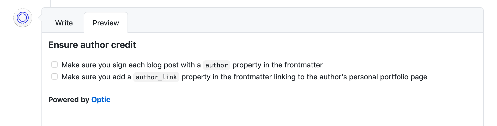

# Playbook

keep everyone on the same page

## Example Usage

Imagine you have a complex project, and want to ensure that any changes to the `docs/` folder follow certain guidelines. We can thus create a `.playbook` file in the `docs/` folder, giving a certain id

```.playbook
credit_to_author
```

Now, you can define that requirement in your `playbook.yml`, located at the root of the repository.

```yaml
credit_to_author:
  title: Ensure author credit # optional field, defaults to key name
  requirements:
   - Make sure you sign each blog post with a `author` property in the frontmatter
   - Make sure you add a `author_link` property in the frontmatter linking to the author's personal portfolio page 
```

Now, whenever someone makes a pull request that modifies a file in the `docs/` folder, Playbook will comment with the requirements.



You can also enforce the requirement for specific files:


```.playbook
credit_to_author -- **/*.md
```

Additionally, you can leverage playbook requirements from other repositories, allowing you to pull requirements from different repositories, or define standard uses:


```.playbook
@opticdev/playbook:credit_to_author
```

